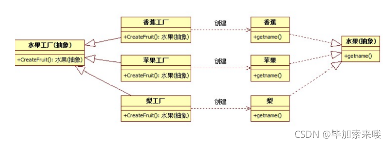

# 工厂模式

## 简介
    简单工厂模式 + “开闭原则” = 工厂方法模式
        工厂方法(Factory Method)模式的意义是定义一个创建产品对象的工厂接口，将实际创建工作推迟到子类当中。核心工厂类不再负责产品的创建，
    这样核心类成为一个抽象工厂角色，仅负责具体工厂子类必须实现的接口，这样进一步抽象化的好处是使得工厂方法模式可以使系统在不修改具体工厂角
    色的情况下引进新的产品。
        工厂方法模式是简单工厂模式的衍生，解决了许多简单工厂模式的问题。首先完全实现‘开－闭 原则’，实现了可扩展。

## UML


## 工厂模式总结

### 传统
        如果想创建两个苹果，得具体实例化两个，然后再调用功能，以后再用还得记名字
```C++
Apple a；
a.func();
Aplle b；
b.func();
```

### 工厂模式
        可以不用具体一个对象，然后调用
```C++
factory = new AppleFactory;
fruit = factory->CreateFruit();//造a
fruit->ShowName();
fruit = factory->CreateFruit();//造b
fruit->ShowName();
```