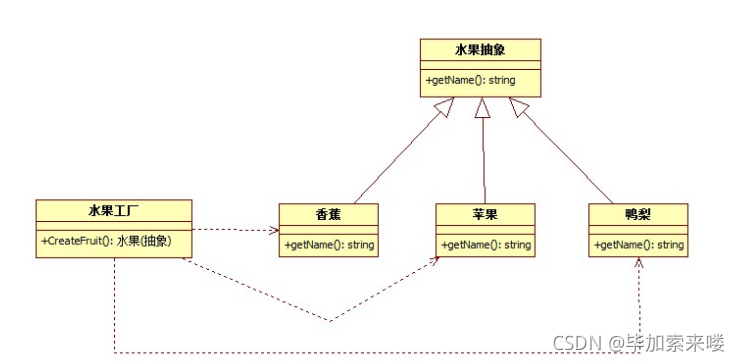

# 原型模式
        Fruit类是一个“巨大的”类，在该类的设计中存在如下几个问题：
    1. 在Fruit类中包含很多“if…else…”代码块，整个类的代码相当冗长，代码越长，阅读难度、维护难度和测试难度也越大；而且大量条件语句的存在还将影响系统的性能，程序在执行过程中需要做大量的条件判断。
    2. Fruit类的职责过重，它负责初始化和显示所有的水果对象，将各种水果对象的初始化代码和显示代码集中在一个类中实现，违反了“单一职责原则”，不利于类的重用和维护；
    3. 当需要增加新类型的水果时，必须修改Fruit类的源代码，违反了“开闭原则”。

## UML

## 简单工厂模式的优缺点
### 优点：
    1. 实现了对象创建和使用的分离。
    2. 不需要记住具体类名，记住参数即可，减少使用者记忆量。
### 不足：
    1. 对工厂类职责过重，一旦不能工作，系统受到影响。
    2. 增加系统中类的个数，复杂度和理解度增加。
    3. 违反“开闭原则”，添加新产品需要修改工厂逻辑，工厂越来越复杂。

## 适用场景
    1. 工厂类负责创建的对象比较少，由于创建的对象较少，不会造成工厂方法中的业务逻辑太过复杂。
    2. 客户端只知道传入工厂类的参数，对于如何创建对象并不关心。

