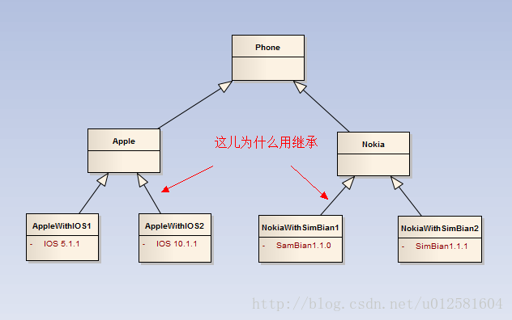
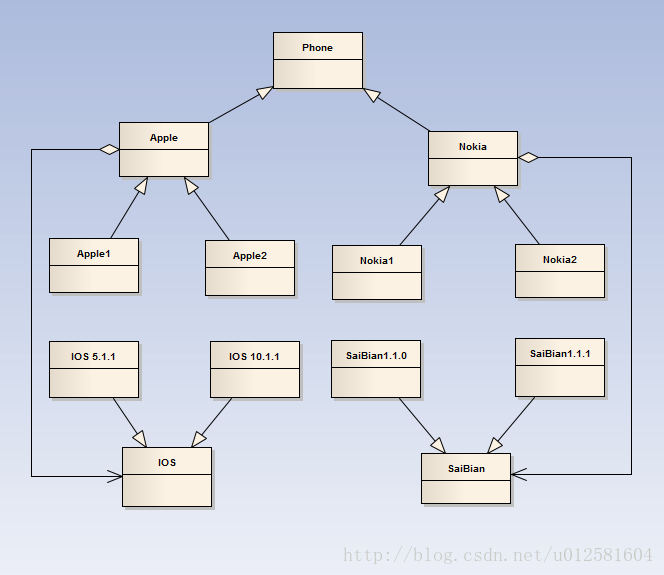
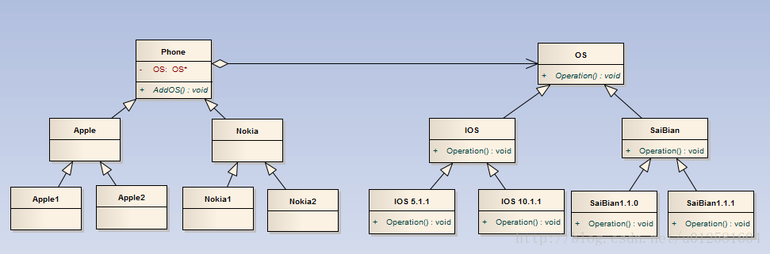

# 桥接模式
        将抽象部分与它的实现部分分离，使它们都可以独立地变化。它是一种对象结构型模式，又称为柄体(Handle and Body)模式或接口(Interface)模式。

## 场景描述
        假如现在需要一个手机装配系统，从手机的角度，我们可以把手机分为苹果，诺基亚，华为，OPPO等等。从手机的操作系统又分为IOS，安卓，塞班等。
    而手机系统又有版本一说，可能老款的手机对新版本的系统没办法支持。所以要实现这么一个手机类型多样化，操作系统多样化的系统。我们该怎么实现呢？

### 一步一步进化到桥接模式
        桥接模式具体是什么，我们先不不要知道。假如现在我们直接实现上述场景，我们会怎么实现呢？通过类图来说一下第一个版本的设计。

        由于手机分为多种类型的，那么将手机抽象出来，在Phone中定义手机的公共接口，各种类型的手机通过继承来实现自己的接口。对特定的手机安装他们特定的操作系统。总体设计如上述类图一般。
    这种实现的缺点：
        1. 很明显，当现在又要加一种手机的时候，手机的操作系统无法复用，我们每实现一个手机，就要在实现类中去实现它的操作系统。
        2. 如果现在要升级一个手机的操作系统，那么就必须修改实现类中的操作系统源码。这很显然是不合适的。
        3. 最主要的是上述类图中，我们要给一个手机添加操作系统的时候，为什么要通过继承来实现？手机和操作系统的关系应该是has-a的关系而不是is-a。
        综上几点，该方案虽然最后可以勉强实现，但是是有问题的。既然上述设计中通过继承来实现给手机添加操作系统是有问题的。那么我们换一种实现方式。类图如下。

        该设计中是将这个需求考虑的比较清楚，不仅把多种多样的手机抽象化，而且将多种多样的操作系统也抽象化了。特定的手机需要特定的操作系统，
    通过组合来实现，如此一来，操作系统不管如何变，在特定的手机类的实现中是不需要改变的。总体来说，比第一种设计好太多了。但是依旧存在如下问题：
        如果手机需要更换升级操作系统，那是不是需要修改所依赖的操作系统呢？
        涉及到依赖的时候，我们不妨想想设计模式六大原则——依赖倒置原则，如果两个类存在依赖，那么要尽可能的去依赖其抽象，而不是其具体实现。所以在该实现中，是违背了依赖倒置原则。
    针对上一种实现的缺点，我们将实现再升级一下。设计类图如下图所示：

        该设计中，苹果手机已经不是依赖于IOS的具体实现，而是依赖于IOS的抽象。同样的诺基亚手机也是一样的实现。 那这样实现是不是就完美了呢？诚然不是的。
    假如有一天，诺基亚把苹果公司收购了，要把苹果手机的系统都更换成塞班系统的时候，我们所依赖的IOS的抽象是不是就需要修改了呢？所以该设计中虽然是把上一种设计升级了，
    但是依旧在一定的程度上违反了依赖倒置原则。
        再针对上一种模式的缺点，我们再次设计类图如下。

        如此实现，就完全克服了我们之前实现中所说的缺点。而这也是桥接模式的具体实现方式，将抽象和实现分离，这里的抽象和实现并不是C++继承中的抽象实现。
    这里的抽象指的是变化不大的接口，而实现指的是易变化的类。这里的将抽象和实现分离，是将具有聚合/关联关系的两个类进行分离解耦，使得一个类的变化对另外一个类无影响。这就是我所理解的桥接模式。

## 优缺点
### 优点：
    1. 将抽象与实现分离，提高了系统的可扩展性。
    2. 不管是在两个维度还是更高维度上变化，都只需要在各自维度的变化上修改即可，不需要修改原有系统。

### 缺点：
    1. 维度变化过多过杂，很难将单纯变化的两个维度分离开来。在设计上有一定难度。

## 适用场景
    1. 适用于有两个维度以上的变化，并且都需要扩展时。
    2. 适用于一个易于变化的对象需要在多个类中共享时。
